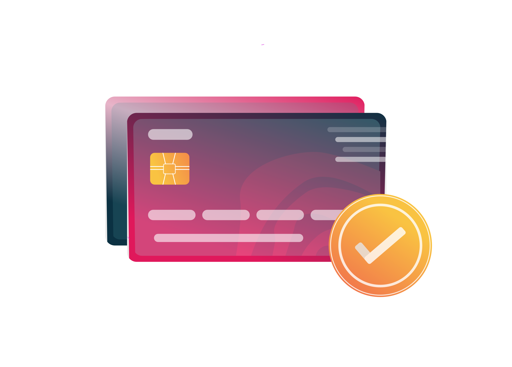
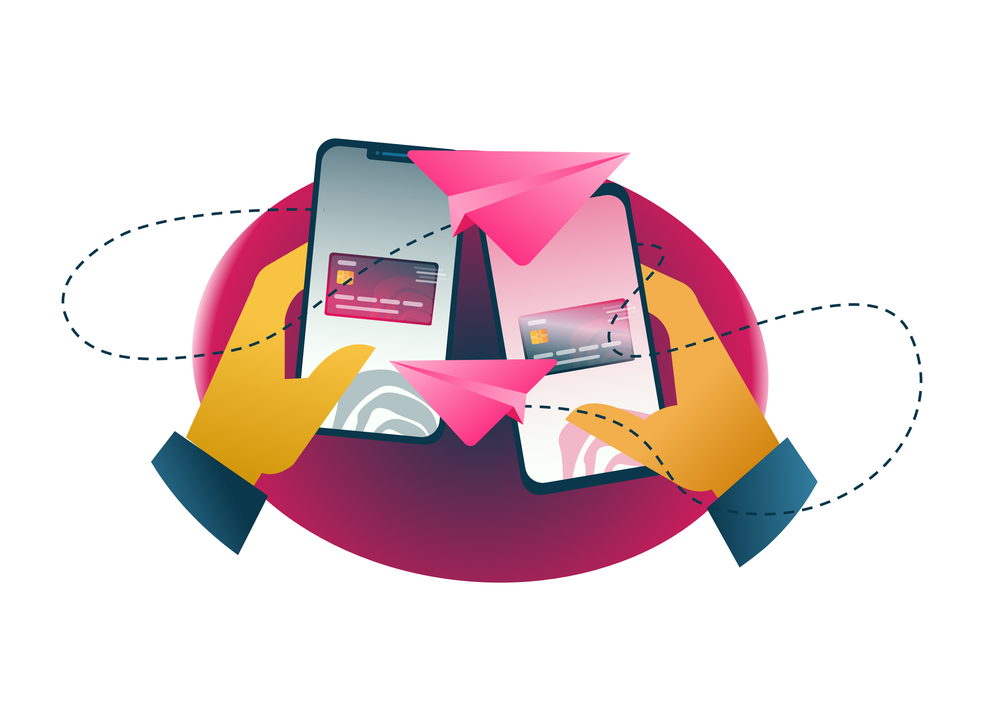
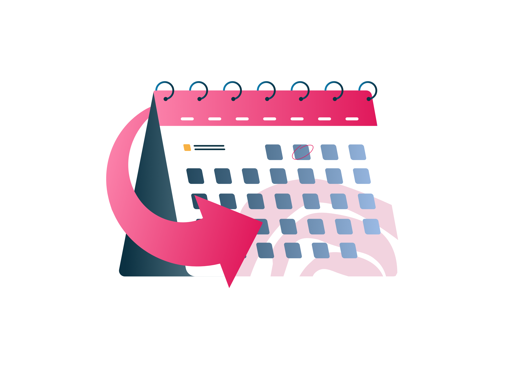
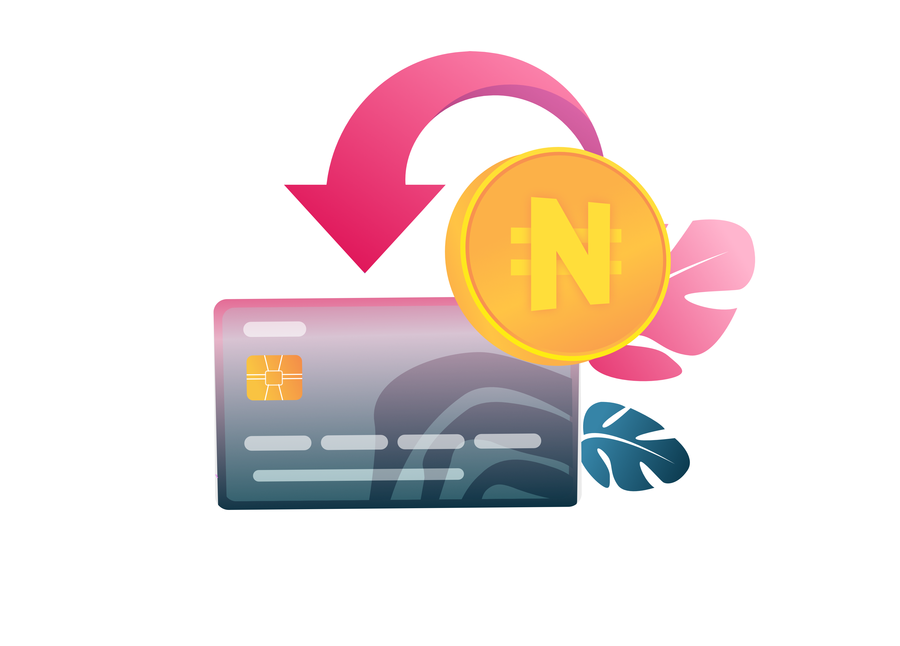

# Home

We're excited to introduce a payment feature that enables you to make and receive payments from any location across the globe! This means that, wherever your customers are, they will be able to make payments for your products successfully. This way, you can more reliably deliver value to customers.

## Getting Started

               

               

## Explore Demos

### Accept Payment

How to use Squad API to accept payment

###

### Transfer

How to make a quick transfer on Squad

