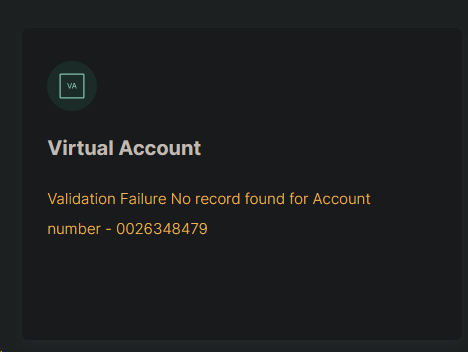

# Squad Payment Modal

## Payment Modal&#x20;

Squad Payment Modal provides an easy and convenient payment flow. It is the simplest way to securely collect payments from your customers without them leaving your website. The customer will be shown all the payment methods you have selected.

It can be integrated with simple steps, by copying the code in the embedded section and pasting it on your page; making it the easiest way to accept payments. It works across devices and can help increase your conversion.

### Parameters

To initialize a transaction, you need to pass details such as email, first name, last name, amount, transaction reference, etc. Email, amount, and currency are **required**. You can also pass any other additional information in the `metadata` object field. The following is a complete list of parameters that you can pass:

| **PARAMETERS** | **REQUIRED?** | **DESCRIPTION**                                                                                                                                                                                                                    |
| -------------- | ------------- | ---------------------------------------------------------------------------------------------------------------------------------------------------------------------------------------------------------------------------------- |
| key            | Yes           | Your **Squad** public key. Use the test key found in your [Sandbox account](https://sandbox.squadco.com) in test mode, and use the live key found in your [Squad dashboard](http://dashboard.squadco.com) in live mode.            |
| email          | Yes           | Customer's email address.                                                                                                                                                                                                          |
| amount         | Yes           | The amount you are debiting customer (expressed in the lowest currency value - **`kobo`**& **`cent`**).                                                                                                                            |
| trans\_ref     | No            | Unique case-sensitive transaction reference. Only ``` `**`-`**_,_**`.`**_,_**`=`** and alphanumeric characters are allowed. If you do not pass this parameter, Squad will generate a unique reference for you.                     |
| currency       | Yes           | Currency charge should be performed in. Allowed values are **`NGN`**, **`USD`**. It defaults to your integration currency.                                                                                                         |
| channels       | No            | An array of payment channels to control what channels you want to make available for the user to make a payment with. Available channels include; \[**`'card'`**, **`'bank'`** , ``` `**`'ussd'`**,**`'bank_transfer'`**]          |
| meta           | No            | Object that contains any additional information that you want to record with the transaction. The fields of the `custom_field`object will be displayed on the merchant receipt and transaction information on the Squad dashboard. |
| onSuccess      | No            | JavaScript function that runs when payment is successful. Ideally, this should be a script that uses the verify endpoint on the Squad API to check the status of the transaction.                                                  |
| onClose        | No            | Javascript function that is called if the customer closes the payment window instead of making a payment.                                                                                                                          |
| onPending      | No            | Javascript function that is called if the customer clicks on `Close Checkout` before we receive their bank transfer. (This only applies to **`Pay-with-Transfer`** transactions)                                                   |


The customer information can either be retrieved from a form, or from your database if you already have it stored. (Example below)




```typescript
 <form id="paymentForm">
  <div class="form-group">
    <label for="email">Email Address</label>
    <input type="email" id="email-address" required />
  </div>
  <div class="form-group">
    <label for="amount">Amount</label>
    <input type="tel" id="amount" required />
  </div><script src="https://test-checkout.squadinc.co/widget/squad.min.js"></script> <script src="https://test-checkout.squadinc.co/widget/squad.min.js"></script> 
  <div class="form-group">
    <label for="first-name">First Name</label>
    <input type="text" id="first-name" />
  </div>
  <div class="form-group">
    <label for="last-name">Last Name</label>
    <input type="text" id="last-name" />
  </div>
  <div class="form-submit">
    <button type="submit" onclick="SquadPay()"> Submit </button>
  </div>
</form>

```



```javascript
<script src="https://test-checkout.squadinc.co/widget/squad.min.js"></script> 

function SquadPay() {
 
  const squadInstance = new squad({
    onClose: () => console.log("Widget closed"),
    onLoad: () => console.log("Widget loaded successfully"),
    onSuccess: () => console.log(`Linked successfully`),
    key: "test_pk_sample-public-key-1",
    //Change key (test_pk_sample-public-key-1) to the key on your Squad Dashboard
    email: document.getElementById("email-address").value,
    amount: document.getElementById("amount").value * 100,
    //Enter amount in Naira or Dollar (Base value Kobo/cent already multiplied by 100)
    currency_code: "NGN"
  });
  squadInstance.setup();
  squadInstance.open();

}
```



### Initiate transaction

When the customer clicks on the **`submit`** button, initiate a transaction by passing the necessary details (email, amount, and any other parameters) to Squad through to a JavaScript function.&#x20;

```javascript
function SquadPay() {
 
  const squadInstance = new squad({
    onClose: () => console.log("Widget closed"),
    onLoad: () => console.log("Widget loaded successfully"),
    onSuccess: () => console.log(`Linked successfully`),
    key: "test_pk_sample-public-key-1",
    //Change key (test_pk_sample-public-key-1) to the key on your Squad Dashboard
    email: document.getElementById("email-address").value,
    amount: document.getElementById("amount").value * 100,
    //Enter amount in Naira or Dollar (Base value Kobo/cent already multiplied by 100)
    currency_code: "NGN"
  });
  squadInstance.setup();
  squadInstance.open();

}
```

A checkout pop-up will then be displayed for the customer to input their payment information to complete the transaction.&#x20;

## Checkout Demo



## Key Information

1. The `key` field takes your Squad **\_public\_** key.
2. By default, the amount field is already set in the lowest currency unit (kobo, cent). That is, to pay **NGN100**, you have to enter **10000** in the amount field.\
   To convert `amount` to the base currency (Naira, Dollar), multiply the amount parameter by `100` in your code, <mark style="background-color:blue;">amount: document.getElementById("amount").value \* 100</mark>, This will allow you enter the amount in Naira or Dollar as the case may be.
3. Generating a unique `trans_ref` from your system for every transaction is advised, to avoid duplicate attempts.

## Payment Channels

After initialization, there are a couple of payment channels available to the customer to complete the transaction.

### USSD

The USSD channel allows your Nigerian customers to pay you by dialing the USSD code on their mobile devices. Nigerian banks provide USSD services for customers to use for transactions, and we have integrated with some of these banks to allow your customers to complete payments.&#x20;



After dialing the USSD code displayed, the system will prompt the user to input the USSD PIN to authenticate the transaction and then confirm it. All that is needed to initiate USSD payment is the customer's email and the amount to be charged. When the user makes a payment, the response will be sent to your webhook.&#x20;


Therefore, to make it work as expected, webhooks must be configured on your [**Squad dashboard**](http://dashboard.squadco.com)**.**


#### Banks Supported

Here is a list of all the Banks USSD `shortcodes` we currently support:

| Bank                            | USSD Shortcode |
| ------------------------------- | -------------- |
| Access (Diamond) Bank           | 426            |
| Access Bank                     | 901            |
| EcoBank                         | 326            |
| First City Monument Bank (FCMB) | 329            |
| Fidelity Bank                   | 770            |
| First Bank                      | 894            |
| Guaranty Trust                  | 737            |
| Heritage Bank                   | 745            |
| Keystone Bank                   | 7111           |
| Rubies (Highstreet) MFB         | 779            |
| Stanbic IBTC Bank               | 909            |
| Sterling Bank                   | 822            |
| United Bank for Africa (UBA)    | 919            |
| Union Bank                      | 826            |
| Unity Bank                      | 7799           |
| VFD Bank                        | 5037           |
| Wema Bank                       | 945            |
| Zenith Bank                     | 966            |

### Bank Transfer

Squad provides a payment method that makes it possible for customers to pay you through a direct bank account transfer. The customer provides their name, phone number, and email address. Then a preset account number is displayed along with the preregistered bank name.&#x20;

.png>)

## Go Live

&#x20;
