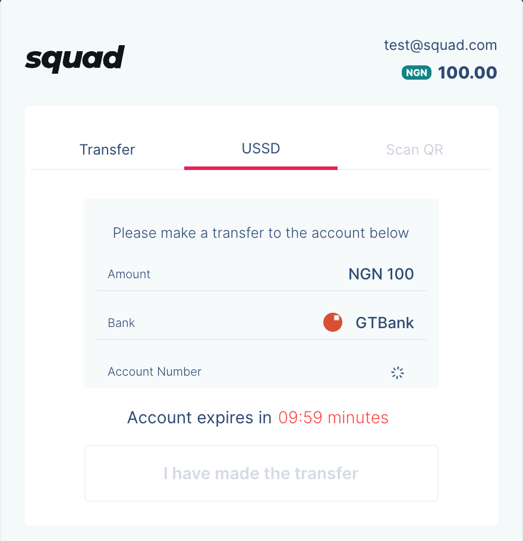

# Payment Channels

### USSD

The USSD channel allows your Nigerian customers to pay you by dialling the USSD code on their mobile devices. Nigerian banks provide USSD services for customers to use for transactions, and we have integrated with some of these banks to allow your customers to complete payments. 

After dialling the USSD code, the system will prompt the user to input the USSD PIN to authenticate the transaction and then confirm it. All that is needed to initiate USSD payment is the customer's email and the amount to be charged. When the user makes a payment, the response will be sent to your webhook. 

Therefore, to make it work as expected, webhooks must be configured on your Squad dashboard.

### Bank 

Squad provides a payment method that makes it possible for customers to pay you through a direct bank account debit. The customer provides their bank account number and authenticating using an OTP sent to their phone or email.

First, you would need to prompt the user to select their bank and enter their account number. To fetch the list of supported banks, make a `GET` request to the [Lookup API](https://raw.githubusercontent.com/tomiiide/nigerian-banks/master/banks.json) endpoint.

