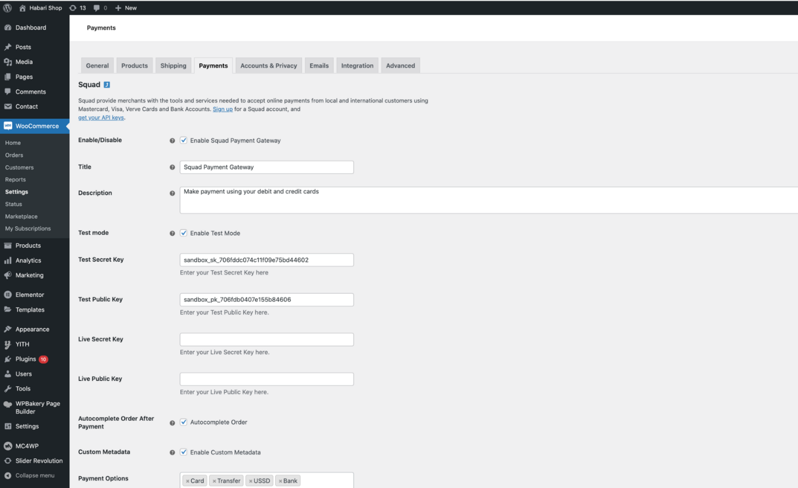
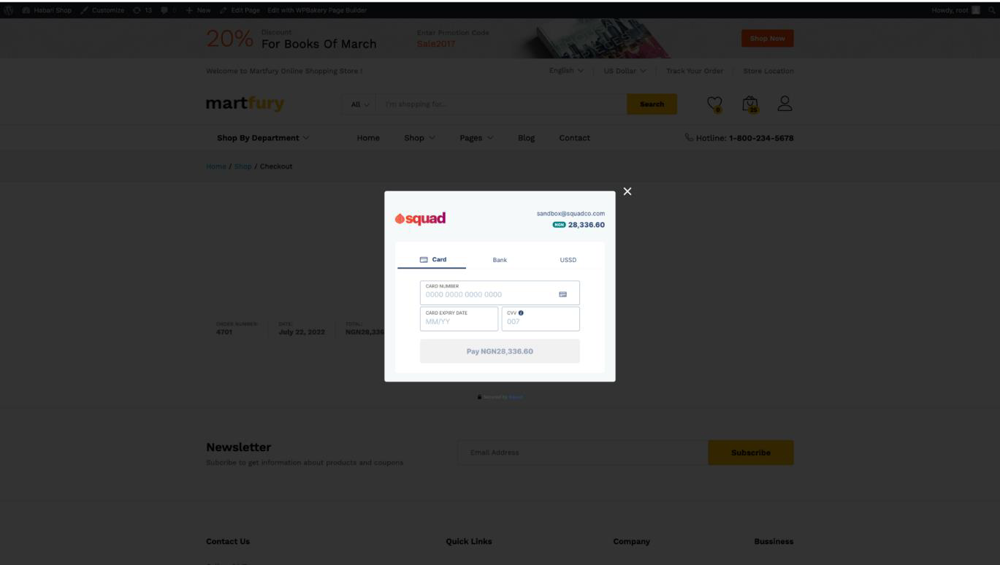

# Squad Woo Commerce Plugin


**This documentation site has been deprecated as of September 8, 2025, and will no longer receive updates. Please refer to the new documentation site at** [**https://docs.squadco.com**](https://docs.squadco.com)**.**


## Overview

Squad helps thousands of businesses in Nigeria to receive secure payments globally. Our goal is to make accepting payments from around the world as easy as possible. Get started by integrating our easy-to-use payment gateway directly on your WooCommerce website to receive local and USD payments quickly and efficiently.

&#x20;Squad enables you to accept payments via multiple methods such as:

* Card payments
* &#x20;Bank transfers
* &#x20;USSD

## Benefits of using Squad payment gateway:&#x20;

* Seamless and easy to use: Squad offers you zero complexities with receiving payments anytime, anywhere. &#x20;
* Suited for one-time, recurring payments and donations.
* Layered with advanced fraud detection to secure your customers’ data.&#x20;
* &#x20;Offers simplified transactions data retrieval.
* Offers you periodic intuitive reports to help you understand your customers better.
* Access to 24/7 dedicated customer support

## Plugin Configuration&#x20;

To configure the plugin:

* go to WooCommerce > Settings from the left menu, click Payments tab. Click on Squad.
* Enable/Disable – check the box to enable Squad Payment Gateway. • Mode – check the box to enable Live Mode.&#x20;
* Webhook Instruction – please ensure that you copied the url displayed in red into your Squad dashboard as described.&#x20;
* Enter Secret Hash – ensure that secret hash entered is the same with the one on your Squad dashboard.&#x20;
* Squad Test Public Key – enter your test public key o sandbox.squadco.com.&#x20;
* Squad Test Secret Key – enter your test secret key o sandbox.squadco.com.&#x20;
* Squad Live Public Key – enter your live public key o dashboard.squadco.com.&#x20;
* Squad Live Secret Key – enter your live secret key o dashboard.squadco.com.&#x20;
* Click Save Changes to save your changes. \

## **Image Descriptions**

<figure><figcaption>
<strong>1/3 - Squad Settings</strong>
</figcaption></figure>

<figure><figcaption>
<strong>2/3 - Sample Order Page</strong>
</figcaption></figure>

<figure><figcaption>
3/3 - Squad Payment Modal
</figcaption></figure>

## Download

Click [here](https://downloads.wordpress.org/plugin/squad-payment-gateway.zip) to download the plugin

## **SUGGESTIONS/CONTRIBUTIONS:**

To contribute, fork the repo, add your changes and modifications then create a pull request.
